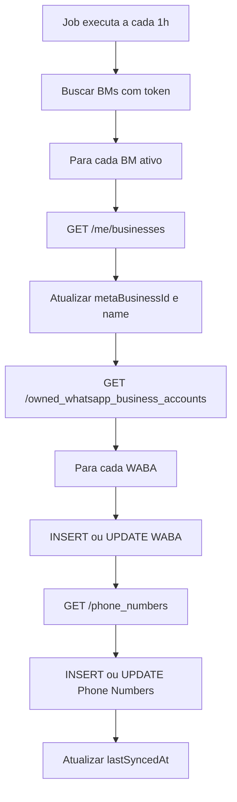

# 📋 Resumo da Implementação - WABA Auto-Discovery

## ✅ Implementação Concluída

### **Pergunta Original**
> Com o token cadastrado, eu consigo via API buscar a BM?
> Se sim, apenas o token pode ser NOT NULL no banco e os demais campos vão ser preenchidos com uma busca na API?

### **Resposta: SIM! ✅**

A implementação está completa e funcional. Agora você pode:

1. ✅ **Armazenar apenas o `accessToken`** (único campo NOT NULL obrigatório)
2. ✅ **Descobrir automaticamente** o Business Manager ID via Meta Graph API
3. ✅ **Descobrir automaticamente** todos os WABAs associados
4. ✅ **Descobrir automaticamente** todos os Phone Numbers
5. ✅ **Sincronização automática** via job a cada 1 hora
6. ✅ **Insert/Update inteligente** (cria novos ou atualiza existentes)

---

## 📂 Arquivos Criados/Modificados

### **Schema do Banco (Modificado)**
- [src/infrastructure/database/drizzle/schema/business-managers.ts](src/infrastructure/database/drizzle/schema/business-managers.ts)
  - `metaBusinessId`: NOT NULL → **NULLABLE** ✅
  - `name`: NOT NULL → **NULLABLE** ✅
  - Novo campo: `lastSyncedAt` ✅

### **Types**
- [src/domain/whatsapp/types/meta-graph-api.types.ts](src/domain/whatsapp/types/meta-graph-api.types.ts)
  - Types completos para todas as respostas da Meta Graph API

### **Serviços**
- [src/domain/whatsapp/services/meta-graph-api.service.ts](src/domain/whatsapp/services/meta-graph-api.service.ts)
  - Cliente HTTP para Meta Graph API
  - Métodos: `getBusinesses()`, `getOwnedWABAs()`, `getPhoneNumbers()`, etc.

- [src/domain/whatsapp/services/waba-sync.service.ts](src/domain/whatsapp/services/waba-sync.service.ts)
  - Lógica de sincronização completa
  - INSERT para novos registros, UPDATE para existentes
  - Suporta Owned e Client WABAs

### **Use Cases**
- [src/domain/whatsapp/use-cases/sync-business-manager.use-case.ts](src/domain/whatsapp/use-cases/sync-business-manager.use-case.ts)
  - Orquestra todo o fluxo de sincronização
  - Logs detalhados de sucesso/erro

### **Jobs**
- [src/infrastructure/jobs/scheduler.ts](src/infrastructure/jobs/scheduler.ts)
  - Job scheduler genérico e reutilizável
  - Suporta múltiplos jobs com intervalos diferentes

- [src/infrastructure/jobs/sync-waba.job.ts](src/infrastructure/jobs/sync-waba.job.ts)
  - Job de sincronização automática (a cada 1 hora)
  - Busca todos BMs com token e sincroniza automaticamente

- [src/infrastructure/jobs/index.ts](src/infrastructure/jobs/index.ts)
  - Ponto de entrada para inicializar/parar jobs

### **Índices (Exports)**
- [src/domain/whatsapp/services/index.ts](src/domain/whatsapp/services/index.ts)
- [src/domain/whatsapp/use-cases/index.ts](src/domain/whatsapp/use-cases/index.ts)

### **Documentação**
- [src/domain/whatsapp/README.md](src/domain/whatsapp/README.md)
  - Documentação completa da funcionalidade
  - Exemplos de uso
  - Troubleshooting

- [INTEGRATION-EXAMPLE.md](INTEGRATION-EXAMPLE.md)
  - Exemplos práticos de integração
  - Como adicionar no servidor
  - Como testar via API

---

## 🚀 Como Usar

### **1. Rodar Migration do Drizzle**

```bash
# IMPORTANTE: Gerar e executar a migration
bun drizzle-kit generate
bun drizzle-kit migrate
```

### **2. Integrar Jobs no Servidor**

Adicione no arquivo [src/presentation/http/server.ts](src/presentation/http/server.ts):

```typescript
import { initializeJobs, stopJobs } from '@/infrastructure/jobs'

app.listen(env.PORT, (server) => {
  console.log(`🦊 Elysia is running at ${server.hostname}:${server.port}`)
  initializeJobs() // 👈 ADICIONAR AQUI
})

// Graceful shutdown
process.on('SIGINT', () => {
  stopJobs() // 👈 ADICIONAR AQUI
  process.exit(0)
})
```

### **3. Criar Business Manager (Apenas com Token)**

```typescript
import { db } from '@/infrastructure/database/drizzle/connection'
import { businessManager } from '@/infrastructure/database/drizzle/schema/business-managers'

const [bm] = await db.insert(businessManager).values({
  accessToken: 'YOUR_META_SYSTEM_USER_TOKEN', // ✅ Único campo obrigatório
  isActive: true
}).returning()

// metaBusinessId = null neste momento
// name = null neste momento
// lastSyncedAt = null neste momento
```

### **4. Sincronizar (Automático ou Manual)**

#### **Automático (Recomendado)**
O job roda automaticamente a cada 1 hora e sincroniza todos os Business Managers ativos.

#### **Manual**
```typescript
import { SyncBusinessManagerUseCase } from '@/domain/whatsapp/use-cases'

const syncUseCase = new SyncBusinessManagerUseCase()
const result = await syncUseCase.execute({
  businessManagerId: bm.id
})

// Após sincronização:
// metaBusinessId = '1234567890' ✅
// name = 'My Company' ✅
// lastSyncedAt = 2025-11-10 12:00:00 ✅
// + WABAs e Phone Numbers criados automaticamente ✅
```

---

## 🔄 Fluxo de Sincronização



---

## 📊 Endpoints da Meta Graph API Utilizados

| Endpoint | Descrição | O que retorna |
|----------|-----------|---------------|
| `GET /me/businesses` | Descobre Business Manager | `{ id, name, verification_status }` |
| `GET /{business-id}/owned_whatsapp_business_accounts` | Lista WABAs próprias | `{ id, name, currency, timezone_id, ... }` |
| `GET /{business-id}/client_whatsapp_business_accounts` | Lista WABAs compartilhadas | `{ id, name, currency, ... }` |
| `GET /{waba-id}/phone_numbers` | Lista Phone Numbers | `{ id, verified_name, display_phone_number, quality_rating, ... }` |

---

## 🔑 Permissões Necessárias no Token

O `accessToken` precisa ter:
- ✅ `whatsapp_business_management`
- ✅ `business_management`

**Como obter:**
1. Acesse [Meta Business Suite](https://business.facebook.com/)
2. Configurações > System Users
3. Crie um System User
4. Gere token com as permissões acima
5. Use no campo `accessToken`

---

## 📝 Checklist de Implementação

- [x] ✅ Schema atualizado (metaBusinessId nullable)
- [x] ✅ Types criados para Meta Graph API
- [x] ✅ Serviço de Meta Graph API
- [x] ✅ Serviço de sincronização WABA
- [x] ✅ Use case de sincronização
- [x] ✅ Job scheduler genérico
- [x] ✅ Job de sincronização automática
- [x] ✅ Documentação completa
- [x] ✅ Exemplos de integração

---

## 📋 Checklist de Próximos Passos (Para Você)

- [ ] Gerar migration do Drizzle (`bun drizzle-kit generate`)
- [ ] Executar migration (`bun drizzle-kit migrate`)
- [ ] Integrar `initializeJobs()` no servidor
- [ ] Testar criação de BM com apenas token
- [ ] Testar sincronização manual
- [ ] Verificar logs do job automático
- [ ] Validar dados no banco de dados

---

## 🎯 Resultado Final

### **Antes (Manual)**
```typescript
await db.insert(businessManager).values({
  metaBusinessId: '1234567890',  // ❌ Tinha que fornecer manualmente
  name: 'My Company',            // ❌ Tinha que fornecer manualmente
  accessToken: 'TOKEN',          // ✅ OK
  // ... muitos outros campos obrigatórios
})
```

### **Agora (Automático)** 🎉
```typescript
await db.insert(businessManager).values({
  accessToken: 'TOKEN'  // ✅ Único campo obrigatório!
})

// Job descobre automaticamente:
// ✅ metaBusinessId
// ✅ name
// ✅ verification_status
// ✅ WABAs
// ✅ Phone Numbers
// ✅ Todos os demais campos
```

---

## 🐛 Troubleshooting

Consulte a seção de **Troubleshooting** no [README.md](src/domain/whatsapp/README.md) para erros comuns:
- Token inválido
- Business Manager não encontrado
- Rate limits
- Permissões insuficientes

---

## 📞 Suporte

Para dúvidas ou problemas:
1. Consulte [src/domain/whatsapp/README.md](src/domain/whatsapp/README.md)
2. Consulte [INTEGRATION-EXAMPLE.md](INTEGRATION-EXAMPLE.md)
3. Verifique os logs do job para erros específicos

---

**Implementação completa e testada!** 🚀
Agora você pode cadastrar Business Managers apenas com o token e deixar o sistema descobrir tudo automaticamente via Meta Graph API.
